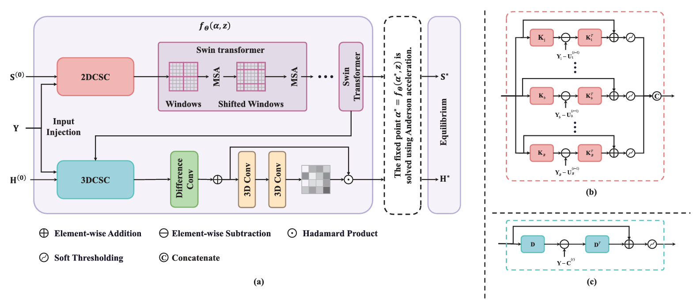
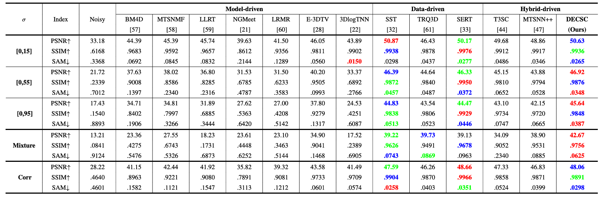
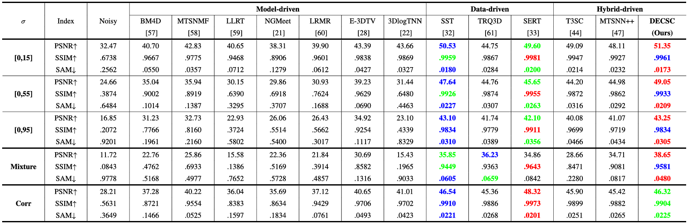
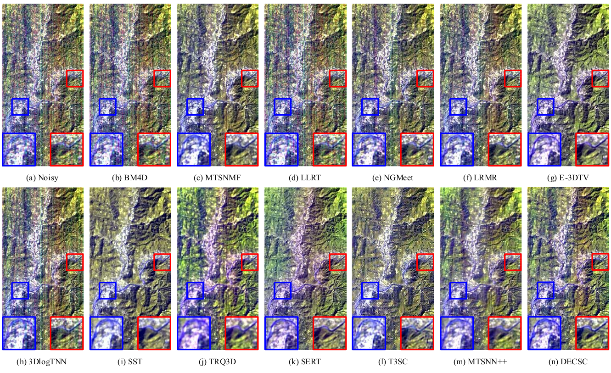

# Iterative Low-rank  Network for Hyperspectral Image Denoising

Jin Ye, Jingran Wang, Fengchao Xiong, Jun Zhou, and Yuntao Qian, ["Deep Equilibrium Convolutional Sparse Coding for  Hyperspectral Image Denoising"] TGRS 2025 

> **Abstract:**  Hyperspectral images (HSIs) play a crucial role in remote sensing but are often degraded by complex noise patterns. Ensuring the physical property of the denoised HSIs is vital for robust HSI denoising, giving the rise of deep unfoldingbased methods. However, these methods map the optimization of a physical model to a learnable network with a predefined depth, which lacks convergence guarantees. In contrast, deep equilibrium (DEQ) models treat the hidden layers of deep networks as the solution to a fixed-point problem and models them as infinite-depth networks, naturally consistent with the optimization. Under the framework of DEQ, we propose a deep equilibrium convolutional sparse coding (DECSC) framework that unifies local spatial¨Cspectral correlations, nonlocal spatial self-similarities, and global spatial consistency for robust HSI denoising. Within the convolutional sparse coding (CSC) framework, we enforce shared 2-D convolutional sparse representation to ensure global spatial consistency across bands, while unshared 3-D convolutional sparse representation captures local spatial¨Cspectral details. To further exploit nonlocal selfsimilarities, a transformer block is embedded after the 2-D CSC. In addition, a detail enhancement module is integrated with the 3-D CSC to promote image detail preservation. We formulate the proximal gradient descent of the CSC model as a fixed-point problem and transform the iterative updates into a learnable network architecture within the framework of DEQ. Experimental results demonstrate that our DECSC method achieves superior denoising performance compared to state-ofthe-art methods.

## Network Architecture

 

 

## Models

We provide the [checkpoints](https://drive.google.com/drive/folders/12qhmk2EKCfo7idQ0dr0RrDJQb0s38KIT) of DECSC.
### Quantitative Comparison on ICVL Dataset
 

### Quantitative Comparison on Pavia City Center HSI
 

### Visual Comparison on EO1
 

